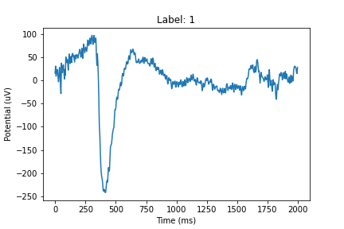
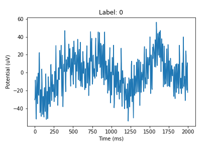
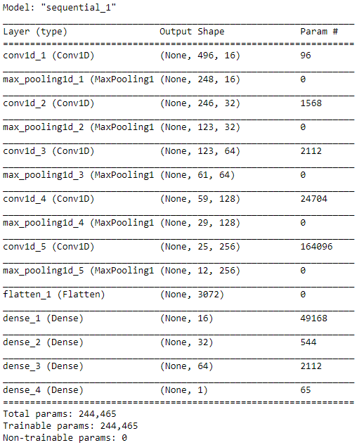

# Blink-Detection

Blink-Detection is a repository designed to classify blinks in raw EEG signals using a 1D Convolutional Neural Network (CNN). When trained on the processed dataset (processed using functions from functions.py), the model achieved a peak accuracy of 95%.

## Data

The dataset used was obtained from: https://github.com/meagmohit/BLINK

Citation:

Mohit Agarwal, Raghupathy Sivakumar
BLINK: A Fully Automated Unsupervised Algorithm for Eye-Blink Detection in EEG Signals
57th Annual Allerton Conference on Communication, Control, and Computing (Allerton). IEEE, 2019.

## Pre-Processing

The file functions.py contains all functions used to process the data prior to modelling. These functions can be used to split and label the original raw EEG signals into filtered two second intervals with binary classifications.

Below is one of the raw EEG signals prior to processing:

  

Once processed, the dataset was populated with filtered intervals such as the following:

  
  

## Model Architecture

  

## Results

The model designed achieved a peak accuracy of 95%.

## Future Work

Performance could be enhanced through further experimentation with filtering, fourier transforms, or improved labeling techniques.